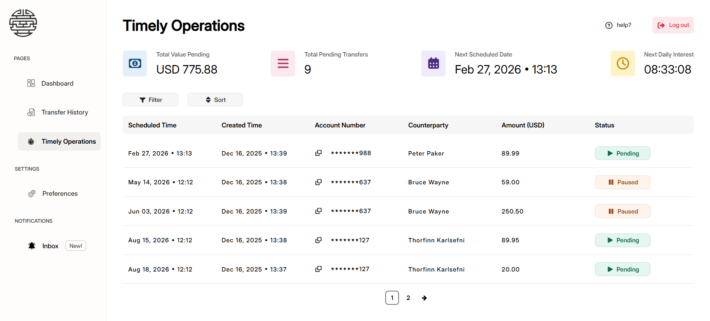
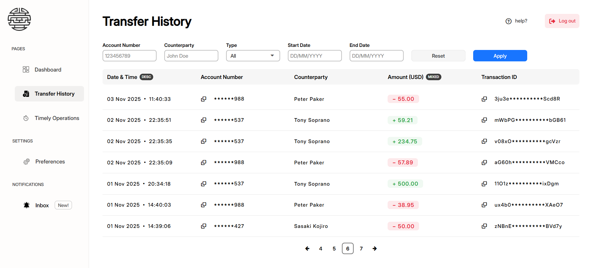
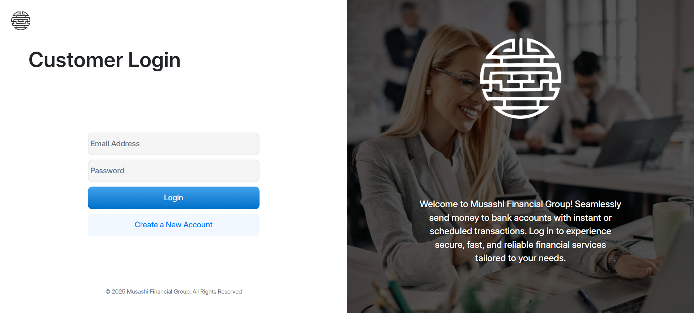
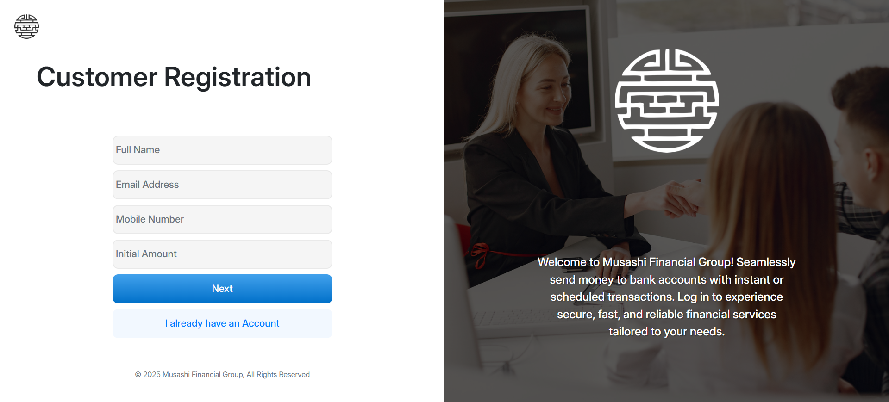
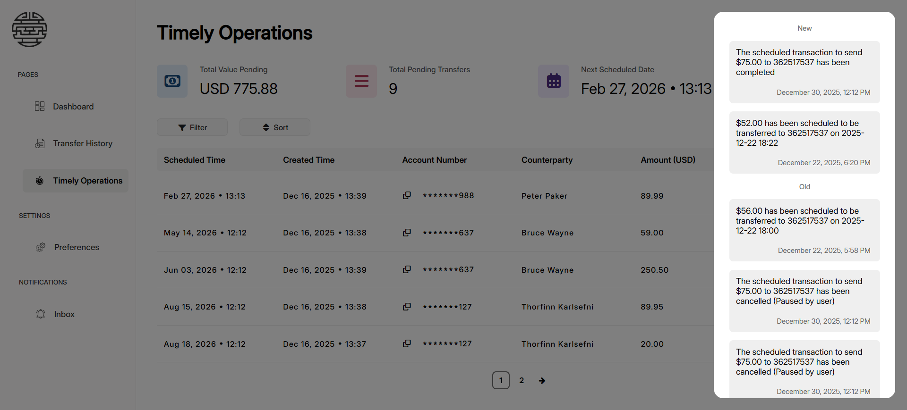
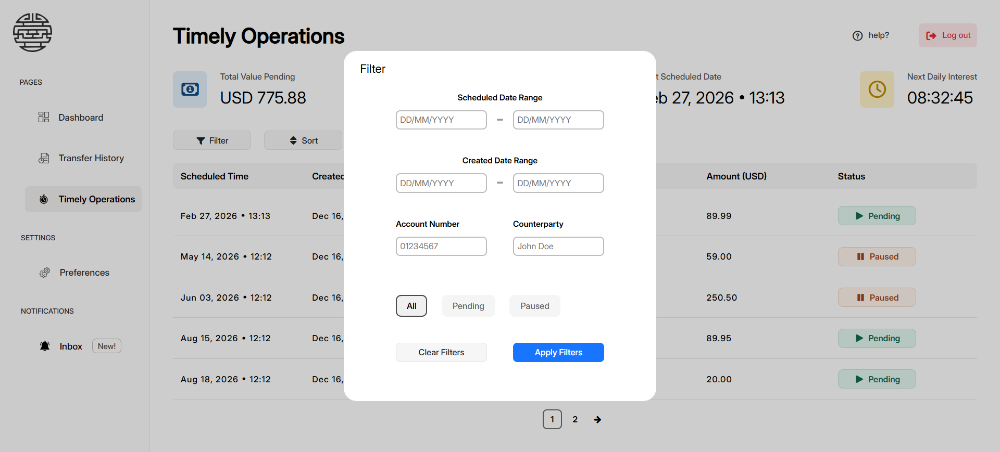
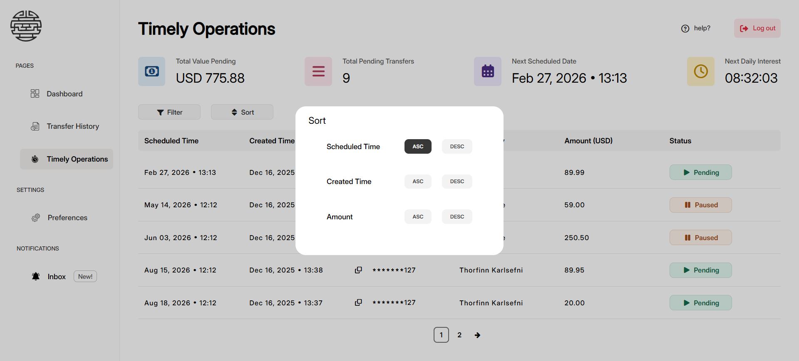

# Musashi Financial Group – Online Banking System

A full-featured **Java EE online banking system** developed as an academic and practical study of enterprise Java technologies.  
The system allows customers of *Musashi Financial Group* to securely manage accounts, perform instant and scheduled transactions, and receive real-time updates without page refreshes.

---

## 🖼️ Screenshots

---

## 🏦 Project Overview

This web application acts as an online banking platform where users can:

- Transfer money between accounts
- Schedule future transactions
- View transaction history with filtering and pagination
- Monitor upcoming scheduled transfers
- Receive real-time notifications for sent and received transactions

The system is designed to support **concurrent access**, **real-time updates**, and **high consistency**, similar to real-world banking platforms.

---

## 🧩 Modules & Packaging

The application is packaged as an **EAR (Enterprise Archive)** and consists of **three modules**:

| Module | Description                                    |
|--------|------------------------------------------------|
| `core` | Entities, DTOs, Service Interfaces             |
| `ejb`  | Business logic, database access, EJBs          |
| `war`  | Web layer (JSP, Servlets, WebSockets, UI)      |
| `ear`  | Enterprise packaging and deployment descriptor |

This structure follows enterprise-grade Java EE best practices.

---

## 🔐 Security Architecture

The application uses **Jakarta EE Security (JSR 375)** with a custom authentication mechanism.

### Implemented security features:

- **Custom `HttpAuthenticationMechanism`**
- **Custom `IdentityStore`**
- **Username–Password authentication**
- **Session-based authentication**
- **Role-Based Access Control (RBAC)**
- **Container-managed security (GlassFish)**

Passwords are encrypted before validation, and authentication is fully integrated with the application server’s security context.

---

## ⚙️ Enterprise Java Technologies Used

### Session Beans (Main Study Focus)

The project was specifically designed to study and apply:

- **Stateless Session Beans**
- **Stateful Session Beans**
- **Singleton Session Beans**

Each bean type is used appropriately based on responsibility:
- Stateless beans for transaction processing
- Stateful beans for user-session-specific workflows
- Singleton beans for shared system-level operations

---

## 🔄 Real-Time & Concurrent System Design

### WebSocket-Based Live Updates

Every major page uses **WebSockets** to provide real-time updates:

- Dashboard updates (balance, recent transactions)
- Transaction history updates
- Scheduled transaction status changes
- Notification panel updates

✔ No page refresh is required  
✔ Changes are reflected instantly

---

### Concurrent Usage Support

The system is designed to handle **concurrent usage safely**:

- The **same user** can log in using **multiple browsers**
- **Different users** can perform transactions simultaneously
- All updates propagate in real time without conflicts
- Data consistency is preserved at all times

> Under no combination of concurrent operations will the system break.

---

## 📊 Application Pages

### 1️⃣ Dashboard
- Instant money transfer
- Scheduled (future) transactions
- Account balance
- Account number
- Account status (active / inactive)
- Latest received transaction
- Latest sent transaction

---

### 2️⃣ Transfer History
- Complete transaction history
- Paginated table view
- Filtering and sorting options
- Live updates for newly completed transactions

---

### 3️⃣ Timely Operations (Scheduled Transactions)
- View all scheduled transactions
- Scheduled date & creation date
- Pause / resume scheduled transfers
- Nearest upcoming transaction date
- Total pending transfer amount
- Total number of scheduled transactions
- Real-time updates for status changes

---

## 🔔 Notification System

- Side-panel notification UI
- Real-time notifications for:
    - Successful sent transactions
    - Successful received transactions
- Powered by WebSockets

---

---

## 🛠️ Technologies Used

- Java EE / Jakarta EE
- GlassFish Server
- Maven
- EJB (Stateless, Stateful, Singleton)
- JSP / Servlets
- WebSockets
- Jakarta Security (JSR 375)
- JDBC / JPA
- IntelliJ IDEA

---

## 🚀 Deployment

- Package type: **EAR**
- Application server: **GlassFish**
- Build tool: **Maven**

---

## 📌 Notes

This project was developed for **educational purposes** and demonstrates:
- Enterprise Java design principles
- Secure authentication and authorization
- Real-time concurrent systems
- Modular Java EE application architecture

---

## 👨‍💻 Author

Developed by **Ravindu Kulasooriya**  
Software Engineering Undergraduate
